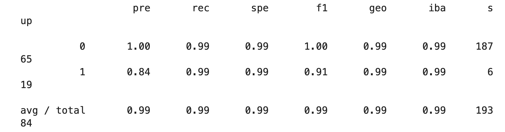

# *Module 12 Report Template*

## Overview of the Analysis

Based on the instructions and data provided, here's a description of the analysis:

1. **Purpose of the analysis**: The goal of the analysis was to create a machine learning model using logistic regression that can predict whether a loan is high-risk (1) or healthy (0), based on a variety of financial data.

2. **Data on financial information**: The dataset contained loan data such as loan size, interest rate, borrower income, debt-to-income ratio, number of accounts, derogatory marks, and total debt. The aim was to predict the loan status, which was a binary variable indicating whether the loan was high-risk (1) or healthy (0).

3. **Basic information about the variables**: The loan_status variable was imbalanced, with many more healthy loans (0) than high-risk ones (1). The `value_counts` were:
    - Healthy loans (0): 75,036
    - High-risk loans (1): 2,500

4. **Stages of the machine learning process**: We first separated the dataset into features (X) and target (y) sets. The data was then split into training and testing datasets. A logistic regression model was trained on the original training data, and its performance was evaluated using metrics like balanced accuracy score, confusion matrix, and classification report.

    The data was then resampled using RandomOverSampler to balance the target variable, and the logistic regression model was trained again on the resampled data. The performance of this model was also evaluated using the same metrics as before.

5. **Methods used**: The main method used was Logistic Regression, a common choice for binary classification problems like this one. Because of the imbalanced nature of the target variable, RandomOverSampler was used to create synthetic samples of the minority class and balance out the dataset. The model's performance was evaluated using balanced accuracy score, confusion matrix, and classification report.

The logistic regression model trained on the oversampled data provided superior performance in terms of recall and the balanced accuracy score, although there was a minor drop in precision for the high-risk loans. This indicates that the oversampling helped the model to better identify the high-risk loans, albeit with a slight increase in the number of healthy loans incorrectly classified as high-risk.

## Results

* Machine Learning Model 1:
  * **Balanced Accuracy Score**: The score was 0.952, indicating a high level of accuracy in classifying both healthy and high-risk loans.
  * **Precision and Recall**:
    * For healthy loans ('0'): The precision was 1.00 and the recall was 0.99. This means the model was excellent at predicting healthy loans, with very few false positives.
    * For high-risk loans ('1'): The precision was 0.85 and the recall was 0.91. This means the model was fairly good at predicting high-risk loans, though there were some false positives and false negatives. 
    

* Machine Learning Model 2 (with resampled data):
  * **Balanced Accuracy Score**: The score improved to 0.994 after resampling, indicating an even better level of accuracy in classifying both types of loans.
  * **Precision and Recall**:
    * For healthy loans ('0'): The precision was 1.00 and the recall was 0.99, similar to Model 1. This means the model continued to perform excellently in predicting healthy loans.
    * For high-risk loans ('1'): The precision slightly dropped to 0.84, but the recall increased significantly to 0.99. This means the model was better at identifying high-risk loans, though at the cost of a slight increase in false positives.
    

## Summary

Based on the data provided, both models exhibit a high degree of accuracy, precision, and recall in predicting loan status. However, the second model, which utilizes oversampling of the minority class (high-risk loans), shows slightly superior overall performance. 

Here's a summary of the results:

* **Machine Learning Model 1**: This model, trained with the original, imbalanced data, performed well, especially in predicting '0' (healthy loans) due to the majority class bias. It was less accurate, but still reasonably good, at predicting '1' (high-risk loans). 

* **Machine Learning Model 2**: This model, trained with oversampled data, performed better overall, especially in predicting '1' (high-risk loans). The use of oversampling helped to address the class imbalance and improve the model's ability to predict the minority class. The recall score for high-risk loans significantly increased, indicating that the model is better at identifying these cases correctly. The slight decrease in precision for high-risk loans is a trade-off for the increase in recall.

Which model performs best depends on the specific problem and the costs associated with false positives versus false negatives. If the goal is to identify as many high-risk loans as possible (even at the cost of classifying some healthy loans as high-risk), then Model 2 is the better choice due to its higher recall score for '1'. However, if the goal is to minimize the misclassification of healthy loans as high-risk, then Model 1 could be preferable due to its slightly higher precision for '1'.

In summary, I would recommend the second machine learning model for this particular problem. Despite its slight drop in precision for high-risk loans, it has better balanced accuracy and much better recall for the high-risk loans. These are critical parameters, especially if the cost associated with failing to identify a high-risk loan is significantly higher than misclassifying a healthy loan.

---

## *Contributors*

For any questions, comments, concerns, feel free to contact below: 

**Rosalinda Olvera Fernandez**

[GitHub](https://github.com/rolvera05) - rolvera98271@gmail.com
